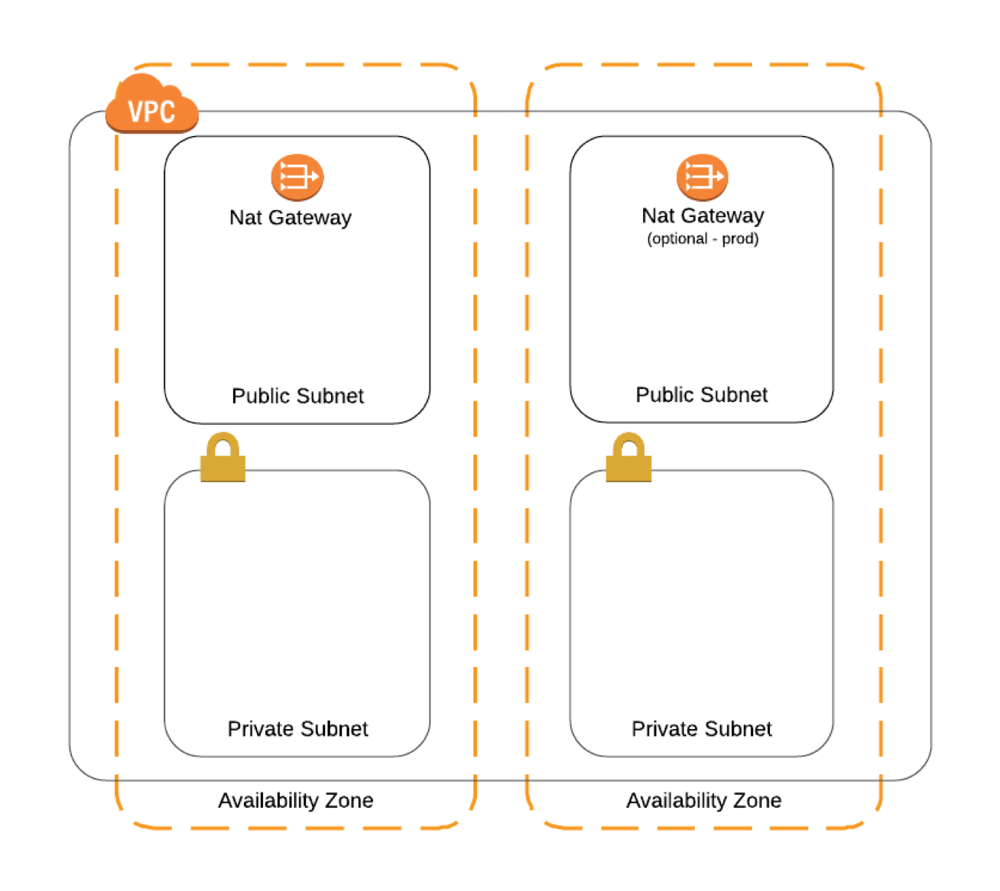
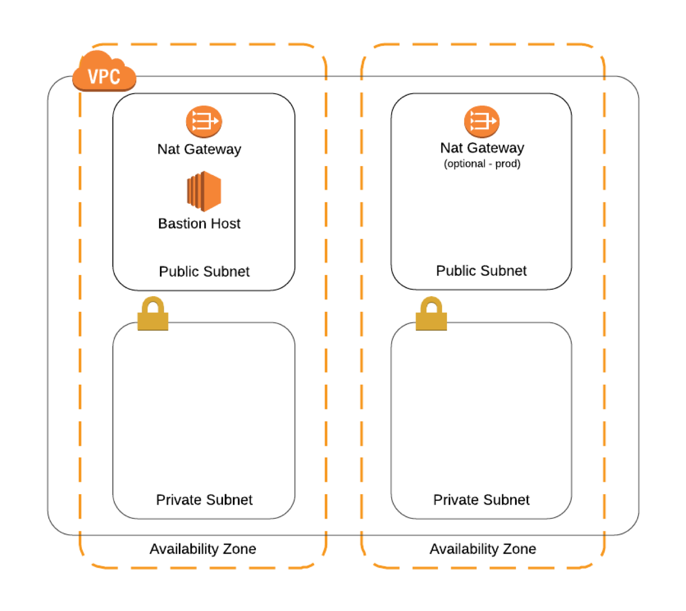
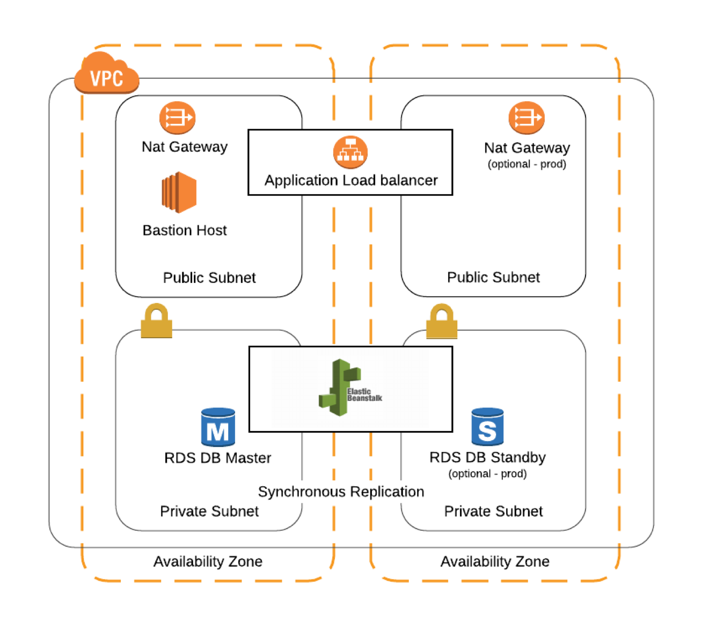
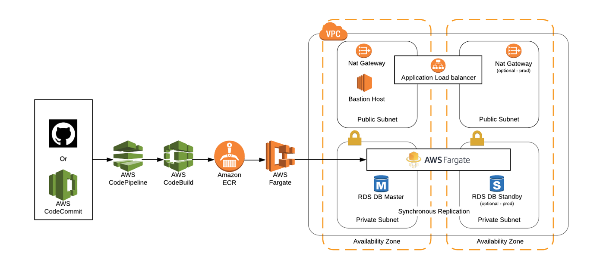
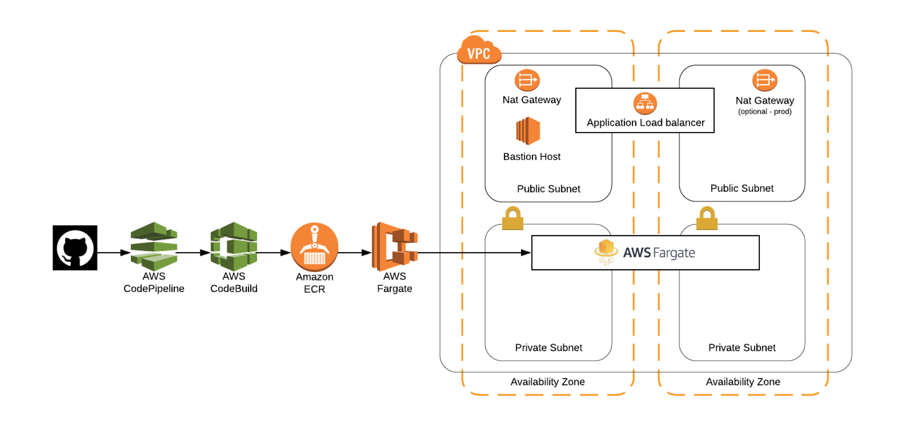

# Overview

The StartupKit-templates repo contains a collection of AWS [CloudFormation](https://docs.aws.amazon.com/AWSCloudFormation/latest/UserGuide/Welcome.html) templates intended to help you set up common pieces of AWS infrastructure. Each template defines a [stack](https://docs.aws.amazon.com/AWSCloudFormation/latest/UserGuide/stacks.html), which is a collection of related resources that can be created, updated, or deleted as a single unit. Templates are available for creating:

- A secure network inside a [VPC](https://docs.aws.amazon.com/AmazonVPC/latest/UserGuide/VPC_Introduction.html) ([jump](#vpc))
- A [bastion host](https://en.wikipedia.org/wiki/Bastion_host) to securely access instances inside the VPC ([jump](#bastion-host))
- A deployment environment using [AWS Elastic Beanstalk](https://docs.aws.amazon.com/elasticbeanstalk/latest/dg/Welcome.html) ([jump](#aws-elastic-beanstalk))
- A container-based environment using [AWS Fargate](https://docs.aws.amazon.com/AmazonECS/latest/developerguide/ECS_GetStarted.html) ([jump](#aws-fargate))
- A relational database using [Amazon RDS](https://docs.aws.amazon.com/AmazonRDS/latest/UserGuide/Welcome.html) ([jump](#amazon-rds))
- An [Amazon Aurora](https://docs.aws.amazon.com/AmazonRDS/latest/UserGuide/CHAP_Aurora.html) DB cluster ([jump](#amazon-aurora))
- An [ElastiCache Cluster](https://docs.aws.amazon.com/AmazonElastiCache/latest/UserGuide/WhatIs.html) ([jump](#amazon-elasticache-cluster))
- [Billing alerts](https://docs.aws.amazon.com/AmazonCloudWatch/latest/monitoring/monitor_estimated_charges_with_cloudwatch.html) for your account ([jump](#billing-alerts))

The VPC template is a requirement for the others. You can either run the templates/vpc.cfn.yml template by itself prior to using the others, or run any one of the vpc-\*.cfn.yml wrapper templates at the top level of this repo to create sets of resources. For example, vpc-bastion-fargate-rds.cfn.yml will create a single stack containing a vpc, bastion host, fargate cluster, and database.

StartupKit is designed to be modular. Some stacks depend on others, some can be deployed individually or in combination with others. You can use the stacks for each module individually and combine them on your own, or use wrapper stacks we have created from the [tables below](#launch-stack) that provide one-click launch for common combinations. The wrapper stacks in the one-click launch table are broken down by regions in order to simplify deployments. See the [Region Table](https://aws.amazon.com/about-aws/global-infrastructure/regional-product-services/) for more information on availability of services by region.

## Prerequisites

If you haven't already done so you first need to:
- [Create an AWS account](https://aws.amazon.com/blogs/startups/how-to-get-started-on-aws-from-a-dead-standstill/).
- Make sure you're signed into AWS as an [IAM user with admin access](https://docs.aws.amazon.com/IAM/latest/UserGuide/getting-started_create-admin-group.html). Don't use the root account!
- [Create an EC2 key pair](https://docs.aws.amazon.com/AWSEC2/latest/UserGuide/ec2-key-pairs.html#having-ec2-create-your-key-pair). This is necessary to use the bastion host.
- [Clone this repo](https://help.github.com/articles/cloning-a-repository/) so that you have a local copy of the templates.

## Creating stacks
Use the AWS [CloudFormation Console](https://console.aws.amazon.com/cloudformation/home) to run the templates. Click the "Create Stack" button in the upper left corner of the console, then under "Choose a template", select "Upload a template to Amazon S3" and click "Browse" to find your local fork of this repository and choose the template you want to run.

To launch stacks directly directly from this README see the [table below](#launching-modular-stacks).

## The templates

Each section contains details about template parameters and the resources created by the stack.

- [vpc.cfn.yml](#vpc)
- [bastion.cfn.yml](#bastion-host)
- [elastic-beanstalk.cfn.yml](#aws-elastic-beanstalk)
- [fargate.cfn.yml](#aws-fargate)
- [db.cfn.yml](#amazon-rds)
- [aurora.cfn.yml](#amazon-aurora)
- [elasticache.cfn.yml](#amazon-elasticache-cluster)
- [billing.cfn.yml](#billing-alerts)

### VPC

The **_vpc.cfn.yml_** template is a prerequisite for most of the others--you need to either run it first, or run one of the wrapper templates at the top level of the repo, which include it. It creates a private networking environment in which you can securely run AWS resources, along with related networking resources.

Subnets are isolated network areas--resources in public subnets are visible to the Internet, resources in private subnets can only be reached from inside the VPC. If a resource in a private subnet needs to communicate externally it has to do so via a NAT Gateway, which acts as a proxy.

The VPC template creates two public and two private subnets, in different [Availability Zones (AZ)](https://docs.aws.amazon.com/AWSEC2/latest/UserGuide/using-regions-availability-zones.html) for redundancy. A subnet is public if it’s associated with an Internet gateway, which allow it to communicate with the Internet

Each subnet has to be associated with a route table, or set of network rules, that define allowed traffic. Route tables operate at the subnet level. The VPC template creates two of them: one for the public subnets, and one for the private.

Security groups act as firewalls at the instance level, to control inbound and outbound traffic. The template creates security groups for an application, load balancer, database, and bastion host. Depending on what other templates you run, not all of them may be used.

	
Resources Created

- 1 [Amazon Virtual Private Cloud](https://aws.amazon.com/vpc/)
- 2 Public [subnets](https://docs.aws.amazon.com/AmazonVPC/latest/UserGuide/VPC_Subnets.html)
- 2 Private subnets
- 1 [Internet gateway](https://docs.aws.amazon.com/AmazonVPC/latest/UserGuide/VPC_Internet_Gateway.html)
- 1 [NAT gateway](https://docs.aws.amazon.com/AmazonVPC/latest/UserGuide/vpc-nat-gateway.html)
- 3 [route tables](https://docs.aws.amazon.com/AmazonVPC/latest/UserGuide/VPC_Route_Tables.html)
- A bunch of [security groups](https://docs.aws.amazon.com/AmazonVPC/latest/UserGuide/VPC_Security.html).

	
Diagram

### Bastion Host

It is preferable not to ssh into EC2 instances at all, instead monitoring instances by configuring them to send logs to [CloudWatch](https://docs.aws.amazon.com/AmazonCloudWatch/latest/logs/WhatIsCloudWatchLogs.html) or other services, and managing instantiation, configuration, and termination of instances using devops tools.

If you do need to connect directly to instances, it's best (and for instances in a private subnets, a requirement) to use a bastion host, otherwise known as a jump box. A bastion host is an EC2 instance that is publicly accessible, and also has access to private resources, allowing it to function as a secure go-between. You configure your EC2 instances to only accept ssh traffic from the bastion host, then you can ssh into the bastion host, and from there connect to your private resources.

EC2 key pairs are required to ssh into any EC2 instance, including bastion hosts. If an attacker gains access to your key pair, they can use it to get into your bastion host, and thus your other resources. In order to prevent this kind of breach the bastion host template supports enabling [Multi-Factor Authentication (MFA)](https://en.wikipedia.org/wiki/Multi-factor_authentication), which is highly recommended

With MFA enabled you use an app like Google Authenticator or Authy to obtain a one-time password, and use this when logging in, in addition to your username and key pair.

You can also set how long CloudWatch logs are retained, and optionally enable Multi-Factor Authentication, among other options.

Creating a Bastion Host stack requires you to have first created a [VPC](#vpc) stack, and to enter the name of the VPC stack as the NetworkStackName parameter.

After the bastion stack has been created, you can log into the [EC2 section of the console](https://console.aws.amazon.com/ec2), find the EC2 instance containing the stack name, copy its public DNS address, and [ssh into it](https://docs.aws.amazon.com/AWSEC2/latest/UserGuide/AccessingInstancesLinux.html). Once on the bastion host you should be able to reach all AWS resources running in the same VPC.

For security and cost optimization it is a best practice to stop (not terminate!) the bastion host when not in use.

See [Enabling Multi-factor authentication on the Bastion Host](docs/bastion-mfa.md) for additional MFA information.

	
Resources Created

- A t2.micro EC2 instance
- An [Elastic IP Address](https://docs.aws.amazon.com/AWSEC2/latest/UserGuide/elastic-ip-addresses-eip.html)
- An [Elastic Network Interface](https://docs.aws.amazon.com/AWSEC2/latest/UserGuide/using-eni.html)
- A [log stream](https://docs.aws.amazon.com/AWSCloudFormation/latest/UserGuide/aws-resource-logs-logstream.html) , and an IAM profile, role, and group for use in logging
- [Cloudwatch alarms](https://docs.aws.amazon.com/AmazonCloudWatch/latest/monitoring/AlarmThatSendsEmail.html) for:
- Three login attempts with invalid username occur within one minute
- Five login attempts with either an invalid key or invalid username occur within five minutes

	
Diagram

### AWS Elastic Beanstalk

AWS Elastic Beanstalk is a service that lets you define an environment for common application types, and deploy code into it. The Beanstalk template is dependent on the VPC, and optionally can be used with the bastion, RDS, or Aurora templates.

Creating a AWS Elastic Beanstalk stack requires you to have first created a [VPC](#vpc) stack, and to enter the name of the VPC stack as the NetworkStackName parameter.

The **_elastic-beanstalk.cfn.yml_** template asks for a series of inputs defining your environment. Those with constrained values are:

- A stack type, with allowed values of node, rails, python, python3 or spring.
- An environment name with allowed values of dev or prod.
- The name of the stack you previously created to define your VPC, as the NetworkStackName parameter.

	
Resources Created

- A service role
- An Elastic Beanstalk application
- An Elastic Beanstalk environment
- An [Auto Scaling Group](https://docs.aws.amazon.com/autoscaling/ec2/userguide/AutoScalingGroup.html)
- A Load Balancer
- Related IAM [Roles](https://docs.aws.amazon.com/IAM/latest/UserGuide/id_roles.html) and [Policies](https://docs.aws.amazon.com/IAM/latest/UserGuide/access_policies.html).

	
Diagram

### AWS Fargate

[AWS Fargate](https://aws.amazon.com/fargate/) is part of [Amazon Elastic Container Service (ECS)](https://aws.amazon.com/ecs/). It's a managed service for running container-based applications, without having to worry about the underlying servers--sort of like [Lambda](https://aws.amazon.com/lambda/) for containers.

Creating a Fargate stack requires you to have first created a [VPC](#vpc) stack, and to enter the name of the VPC stack as the NetworkStackName parameter.

	
Resources Created

- An S3 bucket providing an example of how IAM roles work with containers
- An S3 bucket for CodePipeline artifacts
- A [CodeBuild](https://docs.aws.amazon.com/codebuild/latest/userguide/welcome.html) project
- A CodeBuild service role
- An [Elastic Container Registry (ECR)](https://docs.aws.amazon.com/AmazonECR/latest/userguide/what-is-ecr.html) repository
- An [Application Load Balancer (ALB)](https://docs.aws.amazon.com/elasticloadbalancing/latest/application/introduction.html)
- An [ALB Route 53 record](https://docs.aws.amazon.com/Route53/latest/DeveloperGuide/routing-to-elb-load-balancer.html)
- ELB target groups stuff
- A [Fargate task definition](https://docs.aws.amazon.com/AmazonECS/latest/developerguide/create-task-definition.html)
- A Fargate service with associated scaling resources

	
Diagrams

With RDS/Aurora:

Without RDS/Aurora:

### Amazon RDS

[Amazon Relational Database Service (RDS)](https://aws.amazon.com/rds/) is a service for running relational databases without having to manage the server software, backups, or other maintenance tasks. The RDS service as a whole supports Amazon Aurora, PostgreSQL, MySQL, MariaDB, Oracle, and Microsoft SQL Server; this template currently works with PostgreSQL, MySQL, and MariaDB, and supports t2, m4, and r4 [instance types](https://aws.amazon.com/rds/instance-types/).

Creating an RDS stack requires you to have first created a [VPC](#vpc) stack, and to enter the name of the VPC stack as the NetworkStackName parameter.

	
Resources Created

- A DB instance
- A DB subnet group

### Amazon Aurora

Amazon Aurora is a high-performance cloud-optimized relational database, which is compatible with MySQL and PostgreSQL. It’s treated separately than RDS because Aurora has a few unique characteristics.

Creating an Aurora stack requires you to have first created a [VPC](#vpc) stack, and to enter the name of the VPC stack as the NetworkStackName parameter.

	
Resources Created

- An [Aurora DB Cluster](https://docs.aws.amazon.com/AmazonRDS/latest/UserGuide/Aurora.CreateInstance.html)
- An [Aurora DB instance](https://docs.aws.amazon.com/AmazonRDS/latest/UserGuide/CHAP_Aurora.html)
- A DB subnet group

### Amazon ElastiCache Cluster

Amazon ElastiCache is a managed high-performance in-memory data store, backed with either the Redis or Memcached engines. Running this template lets you select the engine type, number of nodes in the cluser, and the instance type of the nodes.

Creating an ElastiCache stack requires you to have first created a [VPC](#vpc) stack, and to enter the name of the VPC stack as the NetworkStackName parameter.

		
Resources Created

- An [ElastiCache Cluster](https://docs.aws.amazon.com/AmazonElastiCache/latest/UserGuide/WhatIs.html)
- An ElastiCache subnet group
- An ElastiCache security group

### Billing Alerts

If you leave AWS resources running longer than intended, have unexpected traffic levels, or misconfigure or over provision resources, your bill can climb higher or faster than expected. To avoid surprises we recommend turning on billing alerts, so that you're notified when charges go above preconfigured thresholds. The billing alert template makes this easier.

Before running you need to use the AWS console to enable billing alerts:

- Log into the [billing section of the console](https://console.aws.amazon.com/console/home). Click your username on the top right and select 'My Billing Dashboard.'
- Select 'Preferences' from the list of options on the left.
- Check 'Receive Billing Alerts.' Once saved this cannot be disabled.

Now you can run the billing_alert.cfn.yml template, which will create a [CloudWatch alarm](https://docs.aws.amazon.com/AWSCloudFormation/latest/UserGuide/aws-properties-cw-alarm.html) and an [SNS topic](https://docs.aws.amazon.com/sns/latest/dg/CreateTopic.html). You'll be asked for the threshold (in US dollars) for receiving an alert and the email address the alert should be sent to. If you want to get alerts at more than one threshold, you can run the template multiple times.

You can read about more [ways to avoid unexpected charges](https://docs.aws.amazon.com/awsaccountbilling/latest/aboutv2/checklistforunwantedcharges.html).

### Launching Modular Stacks

Select the Category of stack you want to launch below. Then find the row with the combination of modules you are looking for from the checkbox columns (i.e. vpc+bastion host) and select the region you want to launch the stack in. Click 'Launch Stack' button and the CloudFormation console will open automatically with the stack's details.

New services are not immediately available in all AWS Regions, please consult the [Region Table](https://aws.amazon.com/about-aws/global-infrastructure/regional-product-services/) for more information.

Basic Infrastructure Templates (VPC etc)

| CloudFormation | Region Name | Region | VPC | Bastion
:---: | ------------ | ------------- | ------------- | -------------
[ ][us-east-1-vpc] | US East (N. Virginia) | us-east-1 | ✅  |
[ ][us-east-1-vpc-bastion] | US East (N. Virginia) | us-east-1 | ✅  | ✅
[ ][us-east-2-vpc] | US East (Ohio) | us-east-2 | ✅  |
[ ][us-east-2-vpc-bastion] | US East (Ohio) | us-east-2 | ✅  | ✅
[ ][us-west-1-vpc] | US West (N. California) | us-west-1 | ✅  |
[ ][us-west-1-vpc-bastion] | US West (N. California) | us-west-1 | ✅  | ✅
[ ][ca-central-1-vpc] | Canada (Central) | ca-central-1 | ✅  |
[ ][ca-central-1-vpc-bastion] | Canada (Central) | ca-central-1 | ✅  | ✅
[ ][sa-east-1-vpc] | S. America (São Paulo) | sa-east-1 | ✅  |
[ ][sa-east-1-vpc-bastion] | S. America (São Paulo) | sa-east-1 | ✅  | ✅
[ ][eu-west-1-vpc] | EU (Ireland) | eu-west-1 | ✅  |
[ ][eu-west-1-vpc-bastion] | EU (Ireland) | eu-west-1 | ✅  | ✅
[ ][eu-west-2-vpc] | EU (London) | eu-west-2 | ✅  |
[ ][eu-west-2-vpc-bastion] | EU (London) | eu-west-2 | ✅  | ✅
[ ][eu-west-3-vpc] | EU (Paris) | eu-west-3 | ✅  |
[ ][eu-west-3-vpc-bastion] | EU (Paris) | eu-west-3 | ✅  | ✅
[ ][eu-central-1-vpc] | EU (Frankfurt) | eu-central-1 | ✅  |
[ ][eu-central-1-vpc-bastion] | EU (Frankfurt) | eu-central-1 | ✅  | ✅
[ ][ap-northeast-1-vpc] | Asia Pacific (Tokyo) | ap-northeast-1 | ✅  |
[ ][ap-northeast-1-vpc-bastion] | Asia Pacific (Tokyo) | ap-northeast-1 | ✅  | ✅
[ ][ap-northeast-2-vpc] | Asia Pacific (Seoul) | ap-northeast-2 | ✅  |
[ ][ap-northeast-2-vpc-bastion] | Asia Pacific (Seoul) | ap-northeast-2 | ✅  | ✅
[ ][ap-south-1-vpc] | Asia Pacific (Mumbai) | ap-south-1 | ✅  |
[ ][ap-south-1-vpc-bastion] | Asia Pacific (Mumbai) | ap-south-1 | ✅  | ✅
[ ][ap-southeast-1-vpc] | Asia Pacific (Singapore) | ap-southeast-1 | ✅  |
[ ][ap-southeast-1-vpc-bastion] | Asia Pacific (Singapore) | ap-southeast-1 | ✅  | ✅
[ ][ap-southeast-2-vpc] | Asia Pacific (Sydney) | ap-southeast-2 | ✅  |
[ ][ap-southeast-2-vpc-bastion] | Asia Pacific (Sydney) | ap-southeast-2 | ✅  | ✅

AWS Elastic Beanstalk

| CloudFormation | Region Name | Region | VPC | Bastion | DB | Elastic Beanstalk
:---: | ------------ | ------------- | ------------- | ------------- | -------------  | -------------
[ ][us-east-1-vpc-bastion-eb-rds] | US East (N. Virginia) | us-east-1 | ✅  | ✅  | ✅  | ✅  |
[ ][us-east-2-vpc-bastion-eb-rds] | US East (Ohio) | us-east-2 | ✅  | ✅  | ✅  | ✅   |
[ ][us-west-1-vpc-bastion-eb-rds] | US West (N. California) | us-west-1 | ✅  | ✅  | ✅  | ✅  |
[ ][us-west-2-vpc-bastion-eb-rds] | US West (Oregon) | us-west-2 | ✅  | ✅  | ✅  | ✅   |
[ ][ca-central-1-vpc-bastion-eb-rds] | Canada (Central) | ca-central-1 | ✅  | ✅  | ✅  | ✅  |
[ ][sa-east-1-vpc-bastion-eb-rds] | S. America (São Paulo) | sa-east-1 | ✅  | ✅  | ✅  | ✅  |
[ ][eu-west-1-vpc-bastion-eb-rds] | EU (Ireland) | eu-west-1 | ✅  | ✅  | ✅  | ✅   |
[ ][eu-west-2-vpc-bastion-eb-rds] | EU (London) | eu-west-2 | ✅  | ✅  | ✅  | ✅  |
[ ][eu-west-3-vpc-bastion-eb-rds] | EU (Paris) | eu-west-3 | ✅  | ✅  | ✅  | ✅  |
[ ][eu-central-1-vpc-bastion-eb-rds] | EU (Frankfurt) | eu-central-1 | ✅  | ✅  | ✅  | ✅  |
[ ][ap-northeast-1-vpc-bastion-eb-rds] | Asia Pacific (Tokyo) | ap-northeast-1 | ✅  | ✅  | ✅  | ✅  |
[ ][ap-northeast-2-vpc-bastion-eb-rds] | Asia Pacific (Seoul) | ap-northeast-2 | ✅  | ✅  | ✅  | ✅  |
[ ][ap-south-1-vpc-bastion-eb-rds] | Asia Pacific (Mumbai) | ap-south-1 | ✅  | ✅  | ✅  | ✅  |
[ ][ap-southeast-1-vpc-bastion-eb-rds] | Asia Pacific (Singapore) | ap-southeast-1 | ✅  | ✅  | ✅  | ✅  |
[ ][ap-southeast-2-vpc-bastion-eb-rds] | Asia Pacific (Sydney) | ap-southeast-2 | ✅  | ✅  | ✅  | ✅  |

AWS Fargate

| CloudFormation | Region Name | Region | VPC | Bastion | DB | Fargate
:---: | ------------ | ------------- | ------------- | ------------- | -------------  | -------------
[ ][us-east-1-vpc-bastion-fargate] | US East (N. Virginia) | us-east-1 | ✅  | ✅  || ✅  |
[ ][us-east-1-vpc-bastion-fargate-rds] | US East (N. Virginia) | us-east-1 | ✅  | ✅  | ✅  | ✅  |
[ ][us-east-2-vpc-bastion-fargate] | US East (Ohio) | us-east-2 | ✅  | ✅  || ✅  |
[ ][us-east-2-vpc-bastion-fargate-rds] | US East (Ohio) | us-east-2 | ✅  | ✅  | ✅  | ✅  |
[ ][us-west-2-vpc-bastion-fargate] | US West (Oregon) | us-west-2 | ✅  | ✅  || ✅  |
[ ][us-west-2-vpc-bastion-fargate-rds] | US West (Oregon) | us-west-2 | ✅  | ✅  | ✅  | ✅  |
[ ][eu-west-1-vpc-bastion-fargate] | EU (Ireland) | eu-west-1 | ✅  | ✅  || ✅  |
[ ][eu-west-1-vpc-bastion-fargate-rds] | EU (Ireland) | eu-west-1 | ✅  | ✅  | ✅  | ✅  |
[ ][eu-central-1-vpc-bastion-fargate] | EU (Frankfurt) | eu-central-1 | ✅  | ✅  || ✅  |
[ ][eu-central-1-vpc-bastion-fargate-rds] | EU (Frankfurt) | eu-central-1 | ✅  | ✅  | ✅  | ✅  |
[ ][ap-northeast-1-vpc-bastion-fargate] | Asia Pacific (Tokyo) | ap-northeast-1 | ✅  | ✅  || ✅  |
[ ][ap-northeast-1-vpc-bastion-fargate-rds] | Asia Pacific (Tokyo) | ap-northeast-1 | ✅  | ✅  | ✅  | ✅  |
[ ][ap-southeast-1-vpc-bastion-fargate] | Asia Pacific (Singapore) | ap-southeast-1 | ✅  | ✅  || ✅  |
[ ][ap-southeast-1-vpc-bastion-fargate-rds] | Asia Pacific (Singapore) | ap-southeast-1 | ✅  | ✅  | ✅  | ✅  |
[ ][ap-southeast-2-vpc-bastion-fargate] | Asia Pacific (Sydney) | ap-southeast-2 | ✅  | ✅  || ✅  |
[ ][ap-southeast-2-vpc-bastion-fargate-rds] | Asia Pacific (Sydney) | ap-southeast-2| ✅  | ✅  | ✅  | ✅  |

[us-east-1-vpc]: https://console.aws.amazon.com/cloudformation/home?region=us-east-1#/stacks/create/review?templateURL=https://s3.amazonaws.com/awslabs-startup-kit-templates-deploy-v5/vpc.cfn.yml
[us-east-1-vpc-bastion]: https://console.aws.amazon.com/cloudformation/home?region=us-east-1#/stacks/create/review?templateURL=https://s3.amazonaws.com/awslabs-startup-kit-templates-deploy-v5/vpc-bastion.cfn.yml
[us-east-1-vpc-bastion-fargate]: https://console.aws.amazon.com/cloudformation/home?region=us-east-1#/stacks/create/review?templateURL=https://s3.amazonaws.com/awslabs-startup-kit-templates-deploy-v5/vpc-bastion-fargate.cfn.yml
[us-east-1-vpc-bastion-fargate-rds]: https://console.aws.amazon.com/cloudformation/home?region=us-east-1#/stacks/create/review?templateURL=https://s3.amazonaws.com/awslabs-startup-kit-templates-deploy-v5/vpc-bastion-fargate-rds.cfn.yml
[us-east-1-vpc-bastion-eb-rds]: https://console.aws.amazon.com/cloudformation/home?region=us-east-1#/stacks/create/review?templateURL=https://s3.amazonaws.com/awslabs-startup-kit-templates-deploy-v5/vpc-bastion-eb-rds.cfn.yml

[us-east-2-vpc]: https://console.aws.amazon.com/cloudformation/home?region=us-east-2#/stacks/create/review?templateURL=https://s3.amazonaws.com/awslabs-startup-kit-templates-deploy-v5/vpc.cfn.yml
[us-east-2-vpc-bastion]: https://console.aws.amazon.com/cloudformation/home?region=us-east-2#/stacks/create/review?templateURL=https://s3.amazonaws.com/awslabs-startup-kit-templates-deploy-v5/vpc-bastion.cfn.yml
[us-east-2-vpc-bastion-fargate]: https://console.aws.amazon.com/cloudformation/home?region=us-east-2#/stacks/create/review?templateURL=https://s3.amazonaws.com/awslabs-startup-kit-templates-deploy-v5/vpc-bastion-fargate.cfn.yml
[us-east-2-vpc-bastion-fargate-rds]: https://console.aws.amazon.com/cloudformation/home?region=us-east-2#/stacks/create/review?templateURL=https://s3.amazonaws.com/awslabs-startup-kit-templates-deploy-v5/vpc-bastion-fargate-rds.cfn.yml
[us-east-2-vpc-bastion-eb-rds]: https://console.aws.amazon.com/cloudformation/home?region=us-east-2#/stacks/create/review?templateURL=https://s3.amazonaws.com/awslabs-startup-kit-templates-deploy-v5/vpc-bastion-eb-rds.cfn.yml

[us-west-1-vpc]: https://console.aws.amazon.com/cloudformation/home?region=us-west-1#/stacks/create/review?templateURL=https://s3.amazonaws.com/awslabs-startup-kit-templates-deploy-v5/vpc.cfn.yml
[us-west-1-vpc-bastion]: https://console.aws.amazon.com/cloudformation/home?region=us-west-1#/stacks/create/review?templateURL=https://s3.amazonaws.com/awslabs-startup-kit-templates-deploy-v5/vpc-bastion.cfn.yml
[us-west-1-vpc-bastion-eb-rds]: https://console.aws.amazon.com/cloudformation/home?region=us-west-1#/stacks/create/review?templateURL=https://s3.amazonaws.com/awslabs-startup-kit-templates-deploy-v5/vpc-bastion-eb-rds.cfn.yml

[us-west-2-vpc]: https://console.aws.amazon.com/cloudformation/home?region=us-west-2#/stacks/create/review?templateURL=https://s3.amazonaws.com/awslabs-startup-kit-templates-deploy-v5/vpc.cfn.yml
[us-west-2-vpc-bastion]: https://console.aws.amazon.com/cloudformation/home?region=us-west-2#/stacks/create/review?templateURL=https://s3.amazonaws.com/awslabs-startup-kit-templates-deploy-v5/vpc-bastion.cfn.yml
[us-west-2-vpc-bastion-fargate]: https://console.aws.amazon.com/cloudformation/home?region=us-west-2#/stacks/create/review?templateURL=https://s3.amazonaws.com/awslabs-startup-kit-templates-deploy-v5/vpc-bastion-fargate.cfn.yml
[us-west-2-vpc-bastion-fargate-rds]: https://console.aws.amazon.com/cloudformation/home?region=us-west-2#/stacks/create/review?templateURL=https://s3.amazonaws.com/awslabs-startup-kit-templates-deploy-v5/vpc-bastion-fargate-rds.cfn.yml
[us-west-2-vpc-bastion-eb-rds]: https://console.aws.amazon.com/cloudformation/home?region=us-west-2#/stacks/create/review?templateURL=https://s3.amazonaws.com/awslabs-startup-kit-templates-deploy-v5/vpc-bastion-eb-rds.cfn.yml

[sa-east-1-vpc]: https://console.aws.amazon.com/cloudformation/home?region=sa-east-1#/stacks/create/review?templateURL=https://s3.amazonaws.com/awslabs-startup-kit-templates-deploy-v5/vpc.cfn.yml
[sa-east-1-vpc-bastion]: https://console.aws.amazon.com/cloudformation/home?region=sa-east-1#/stacks/create/review?templateURL=https://s3.amazonaws.com/awslabs-startup-kit-templates-deploy-v5/vpc-bastion.cfn.yml
[sa-east-1-vpc-bastion-eb-rds]: https://console.aws.amazon.com/cloudformation/home?region=sa-east-1#/stacks/create/review?templateURL=https://s3.amazonaws.com/awslabs-startup-kit-templates-deploy-v5/vpc-bastion-eb-rds.cfn.yml

[eu-west-1-vpc]: https://console.aws.amazon.com/cloudformation/home?region=eu-west-1#/stacks/create/review?templateURL=https://s3.amazonaws.com/awslabs-startup-kit-templates-deploy-v5/vpc.cfn.yml
[eu-west-1-vpc-bastion]: https://console.aws.amazon.com/cloudformation/home?region=eu-west-1#/stacks/create/review?templateURL=https://s3.amazonaws.com/awslabs-startup-kit-templates-deploy-v5/vpc-bastion.cfn.yml
[eu-west-1-vpc-bastion-fargate]: https://console.aws.amazon.com/cloudformation/home?region=eu-west-1#/stacks/create/review?templateURL=https://s3.amazonaws.com/awslabs-startup-kit-templates-deploy-v5/vpc-bastion-fargate.cfn.yml
[eu-west-1-vpc-bastion-fargate-rds]: https://console.aws.amazon.com/cloudformation/home?region=eu-west-1#/stacks/create/review?templateURL=https://s3.amazonaws.com/awslabs-startup-kit-templates-deploy-v5/vpc-bastion-fargate-rds.cfn.yml
[eu-west-1-vpc-bastion-eb-rds]: https://console.aws.amazon.com/cloudformation/home?region=eu-west-1#/stacks/create/review?templateURL=https://s3.amazonaws.com/awslabs-startup-kit-templates-deploy-v5/vpc-bastion-eb-rds.cfn.yml

[eu-west-2-vpc]: https://console.aws.amazon.com/cloudformation/home?region=eu-west-2#/stacks/create/review?templateURL=https://s3.amazonaws.com/awslabs-startup-kit-templates-deploy-v5/vpc.cfn.yml
[eu-west-2-vpc-bastion]: https://console.aws.amazon.com/cloudformation/home?region=eu-west-2#/stacks/create/review?templateURL=https://s3.amazonaws.com/awslabs-startup-kit-templates-deploy-v5/vpc-bastion.cfn.yml
[eu-west-2-vpc-bastion-eb-rds]: https://console.aws.amazon.com/cloudformation/home?region=eu-west-2#/stacks/create/review?templateURL=https://s3.amazonaws.com/awslabs-startup-kit-templates-deploy-v5/vpc-bastion-eb-rds.cfn.yml

[eu-west-3-vpc]: https://console.aws.amazon.com/cloudformation/home?region=eu-west-3#/stacks/create/review?templateURL=https://s3.amazonaws.com/awslabs-startup-kit-templates-deploy-v5/vpc.cfn.yml
[eu-west-3-vpc-bastion]: https://console.aws.amazon.com/cloudformation/home?region=eu-west-3#/stacks/create/review?templateURL=https://s3.amazonaws.com/awslabs-startup-kit-templates-deploy-v5/vpc-bastion.cfn.yml
[eu-west-3-vpc-bastion-eb-rds]: https://console.aws.amazon.com/cloudformation/home?region=eu-west-3#/stacks/create/review?templateURL=https://s3.amazonaws.com/awslabs-startup-kit-templates-deploy-v5/vpc-bastion-eb-rds.cfn.yml

[eu-central-1-vpc]: https://console.aws.amazon.com/cloudformation/home?region=eu-central-1#/stacks/create/review?templateURL=https://s3.amazonaws.com/awslabs-startup-kit-templates-deploy-v5/vpc.cfn.yml
[eu-central-1-vpc-bastion]: https://console.aws.amazon.com/cloudformation/home?region=eu-central-1#/stacks/create/review?templateURL=https://s3.amazonaws.com/awslabs-startup-kit-templates-deploy-v5/vpc-bastion.cfn.yml
[eu-central-1-vpc-bastion-fargate]: https://console.aws.amazon.com/cloudformation/home?region=eu-central-1#/stacks/create/review?templateURL=https://s3.amazonaws.com/awslabs-startup-kit-templates-deploy-v5/vpc-bastion-fargate.cfn.yml
[eu-central-1-vpc-bastion-fargate-rds]: https://console.aws.amazon.com/cloudformation/home?region=eu-central-1#/stacks/create/review?templateURL=https://s3.amazonaws.com/awslabs-startup-kit-templates-deploy-v5/vpc-bastion-fargate-rds.cfn.yml
[eu-central-1-vpc-bastion-eb-rds]: https://console.aws.amazon.com/cloudformation/home?region=eu-central-1#/stacks/create/review?templateURL=https://s3.amazonaws.com/awslabs-startup-kit-templates-deploy-v5/vpc-bastion-eb-rds.cfn.yml

[ap-south-1-vpc]: https://console.aws.amazon.com/cloudformation/home?region=ap-south-1#/stacks/create/review?templateURL=https://s3.amazonaws.com/awslabs-startup-kit-templates-deploy-v5/vpc.cfn.yml
[ap-south-1-vpc-bastion]: https://console.aws.amazon.com/cloudformation/home?region=ap-south-1#/stacks/create/review?templateURL=https://s3.amazonaws.com/awslabs-startup-kit-templates-deploy-v5/vpc-bastion.cfn.yml
[ap-south-1-vpc-bastion-eb-rds]: https://console.aws.amazon.com/cloudformation/home?region=ap-south-1#/stacks/create/review?templateURL=https://s3.amazonaws.com/awslabs-startup-kit-templates-deploy-v5/vpc-bastion-eb-rds.cfn.yml

[ap-northeast-1-vpc]: https://console.aws.amazon.com/cloudformation/home?region=ap-northeast-1#/stacks/create/review?templateURL=https://s3.amazonaws.com/awslabs-startup-kit-templates-deploy-v5/vpc.cfn.yml
[ap-northeast-1-vpc-bastion]: https://console.aws.amazon.com/cloudformation/home?region=ap-northeast-1#/stacks/create/review?templateURL=https://s3.amazonaws.com/awslabs-startup-kit-templates-deploy-v5/vpc-bastion.cfn.yml
[ap-northeast-1-vpc-bastion-fargate]: https://console.aws.amazon.com/cloudformation/home?region=ap-northeast-1#/stacks/create/review?templateURL=https://s3.amazonaws.com/awslabs-startup-kit-templates-deploy-v5/vpc-bastion-fargate.cfn.yml
[ap-northeast-1-vpc-bastion-fargate-rds]: https://console.aws.amazon.com/cloudformation/home?region=ap-northeast-1#/stacks/create/review?templateURL=https://s3.amazonaws.com/awslabs-startup-kit-templates-deploy-v5/vpc-bastion-fargate-rds.cfn.yml
[ap-northeast-1-vpc-bastion-eb-rds]: https://console.aws.amazon.com/cloudformation/home?region=ap-northeast-1#/stacks/create/review?templateURL=https://s3.amazonaws.com/awslabs-startup-kit-templates-deploy-v5/vpc-bastion-eb-rds.cfn.yml

[ap-northeast-2-vpc]: https://console.aws.amazon.com/cloudformation/home?region=ap-northeast-2#/stacks/create/review?templateURL=https://s3.amazonaws.com/awslabs-startup-kit-templates-deploy-v5/vpc.cfn.yml
[ap-northeast-2-vpc-bastion]: https://console.aws.amazon.com/cloudformation/home?region=ap-northeast-2#/stacks/create/review?templateURL=https://s3.amazonaws.com/awslabs-startup-kit-templates-deploy-v5/vpc-bastion.cfn.yml
[ap-northeast-2-vpc-bastion-eb-rds]: https://console.aws.amazon.com/cloudformation/home?region=ap-northeast-2#/stacks/create/review?templateURL=https://s3.amazonaws.com/awslabs-startup-kit-templates-deploy-v5/vpc-bastion-eb-rds.cfn.yml

[ap-southeast-1-vpc]: https://console.aws.amazon.com/cloudformation/home?region=ap-southeast-1#/stacks/create/review?templateURL=https://s3.amazonaws.com/awslabs-startup-kit-templates-deploy-v5/vpc.cfn.yml
[ap-southeast-1-vpc-bastion]: https://console.aws.amazon.com/cloudformation/home?region=ap-southeast-1#/stacks/create/review?templateURL=https://s3.amazonaws.com/awslabs-startup-kit-templates-deploy-v5/vpc-bastion.cfn.yml
[ap-southeast-1-vpc-bastion-fargate]: https://console.aws.amazon.com/cloudformation/home?region=ap-southeast-1#/stacks/create/review?templateURL=https://s3.amazonaws.com/awslabs-startup-kit-templates-deploy-v5/vpc-bastion-fargate.cfn.yml
[ap-southeast-1-vpc-bastion-fargate-rds]: https://console.aws.amazon.com/cloudformation/home?region=ap-southeast-1#/stacks/create/review?templateURL=https://s3.amazonaws.com/awslabs-startup-kit-templates-deploy-v5/vpc-bastion-fargate-rds.cfn.yml
[ap-southeast-1-vpc-bastion-eb-rds]: https://console.aws.amazon.com/cloudformation/home?region=ap-southeast-1#/stacks/create/review?templateURL=https://s3.amazonaws.com/awslabs-startup-kit-templates-deploy-v5/vpc-bastion-eb-rds.cfn.yml

[ap-southeast-2-vpc]: https://console.aws.amazon.com/cloudformation/home?region=ap-southeast-2#/stacks/create/review?templateURL=https://s3.amazonaws.com/awslabs-startup-kit-templates-deploy-v5/vpc.cfn.yml
[ap-southeast-2-vpc-bastion]: https://console.aws.amazon.com/cloudformation/home?region=ap-southeast-2#/stacks/create/review?templateURL=https://s3.amazonaws.com/awslabs-startup-kit-templates-deploy-v5/vpc-bastion.cfn.yml
[ap-southeast-2-vpc-bastion-fargate]: https://console.aws.amazon.com/cloudformation/home?region=ap-southeast-2#/stacks/create/review?templateURL=https://s3.amazonaws.com/awslabs-startup-kit-templates-deploy-v5/vpc-bastion-fargate.cfn.yml
[ap-southeast-2-vpc-bastion-fargate-rds]: https://console.aws.amazon.com/cloudformation/home?region=ap-southeast-2#/stacks/create/review?templateURL=https://s3.amazonaws.com/awslabs-startup-kit-templates-deploy-v5/vpc-bastion-fargate-rds.cfn.yml
[ap-southeast-2-vpc-bastion-eb-rds]: https://console.aws.amazon.com/cloudformation/home?region=ap-southeast-2#/stacks/create/review?templateURL=https://s3.amazonaws.com/awslabs-startup-kit-templates-deploy-v5/vpc-bastion-eb-rds.cfn.yml

[ca-central-1-vpc]: https://console.aws.amazon.com/cloudformation/home?region=ca-central-1#/stacks/create/review?templateURL=https://s3.amazonaws.com/awslabs-startup-kit-templates-deploy-v5/vpc.cfn.yml
[ca-central-1-vpc-bastion]: https://console.aws.amazon.com/cloudformation/home?region=ca-central-1#/stacks/create/review?templateURL=https://s3.amazonaws.com/awslabs-startup-kit-templates-deploy-v5/vpc-bastion.cfn.yml
[ca-central-1-vpc-bastion-eb-rds]: https://console.aws.amazon.com/cloudformation/home?region=ca-central-1#/stacks/create/review?templateURL=https://s3.amazonaws.com/awslabs-startup-kit-templates-deploy-v5/vpc-bastion-eb-rds.cfn.yml
