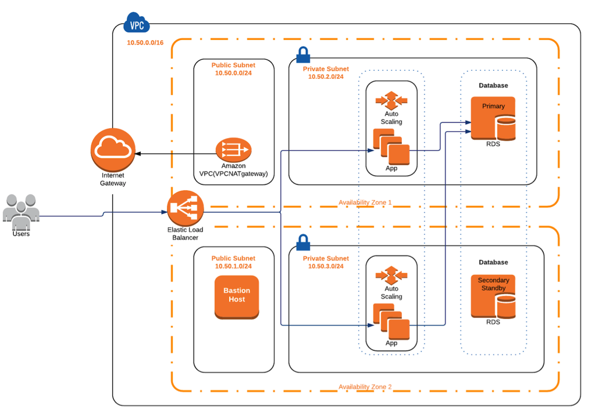

# AWS Startup Kit Templates

The AWS Startup Kit CloudFormation templates create stacks to support well-architected
workloads on AWS. Components include a VPC, a bastion host, and optionally a relational
database and AWS Elastic Beanstalk app.  

The VPC template is the foundation for everything else. It creates a VPC that includes
the following network resources:
- Two public subnets.
- Two private subnets.
- A NAT Gateway to allow instances in private subnets to communicate with AWS services.
- Two route tables, one for public subnets and the other for private subnets.
- Security groups for an app, load balancer, database, and bastion host.
    
The bastion host is used to provide SSH access to instances with private IP addresses in
the application's security group.    

Optionally, a relational database can be created using the db.cfn.yml template. Either
a MySQL or PostgreSQL database is created in the Amazon Relational Database Service
(RDS), which automates much of the heavy lifting of database setup and maintenance.
Following best practices, the database is created in private subnets concealed from the 
public Internet.  Similarly, the optional app template creates an Elastic Beanstalk app
with application servers placed in private subnets while the load balancer in front of
them is placed in public subnets.  The complete architecture is as follows:  

### USING THE TEMPLATES

#### Prerequisites

If you haven't done so already:

- [Make sure you're signed into AWS as an IAM user with admin access](http://docs.aws.amazon.com/IAM/latest/UserGuide/getting-started_create-admin-group.html).
Avoid using the root account.

- [Create an EC2 key pair](http://docs.aws.amazon.com/AWSEC2/latest/UserGuide/ec2-key-pairs.html#having-ec2-create-your-key-pair). This is necessary to use the bastion host.

#### Steps for Creating the Infrastructure

All of the following steps involve using the AWS CloudFormation console. Simply
click the "Create Stack" button in the upper left corner of the console. Next,
under "Choose a template", select "Upload a template to Amazon S3" and click
"Browse" to find your local fork of this repository and choose the relevant template.

Create the stacks in the following order:

**[1] Create the VPC**: select the vpc.cfn.yml template. Pick a relevant stack
name, and an IP address or address range from which you will allow SSH access
to the bastion host. Use [CIDR notation](https://en.wikipedia.org/wiki/Classless_Inter-Domain_Routing).

**[2] Create the bastion**: select the bastion.cfn.yml template. Pick a relevant
stack name, and then enter the name of your EC2 key pair and the name of the VPC
stack you created in step [1]. 

**[3] Create the database**: select the db.cfn.yml template. Pick a relevant stack
name, and then enter the various database parameters such as the user name and
password. For NetworkStackName, enter the name of the VPC stack you created in
step [1]. When selecting the EnvironmentName, dev or prod, keep in mind that 
prod will set up a Multi-AZ RDS database that is highly available and configured
with a primary-standby setup. This is a best practice for production, but not for
a test/development environment and would be an unnecessary expense.

**[4] Create the app**: select the app.cfn.yml template. Pick a relevant stack
name, and enter the name of the S3 bucket and key (file) where you have
stored the app code. For NetworkStackName, enter the name of the VPC stack you
created in step [1], and for DatabaseStackName enter the name of the database
stack you created in step [3].  For the app code itself, you can try out a 
Startup Kit sample workload listed below, or see 'Adding an Application' at 
the end of this README:
        
- https://github.com/awslabs/startup-kit-nodejs

#### Connecting to Your Instances and Database

In general, it is best to treat your fleet of instances as "cattle, not pets" and
avoid SSH'ing into them to manage them individually. When it's necessary to connect
for debugging purposes etc., connect via the bastion host created with the bastion
template. One way to do this is to use SSH agent forwarding. For details about how
to set this up on your local computer, consult the relevant [AWS blog post](https://aws.amazon.com/blogs/security/securely-connect-to-linux-instances-running-in-a-private-amazon-vpc).

Since the database is in a private subnet, it also is necessary to connect to it via
the bastion host using a method such as TCP/IP over SSH. For an example of how 
to do this with MySQL Workbench, see the [documentation](http://dev.mysql.com/doc/workbench/en/wb-mysql-connections-methods-ssh.html).  

In that example, you would replace the SSH Hostname with the public DNS name of
your bastion host, SSH Username with "ec2-user", and SSH Key File with the path 
to the EC2 key pair you created. Ignore the SSH Password field. For MySQL Hostname,
enter the "RdsDbURL" from the Outputs tab for the database stack in the CloudFormation
console. MySQL Server Port is 3306. For the Username and Password fields, enter the 
corresponding outputs for "DbUser" and "DbPassword" from the Outputs tab.

#### Adding an Application

Using the app template automates the process of setting up an app in
AWS Elastic Beanstalk. However, it is not necessary to use the app template to
leverage the benefits of the other templates. You can add an application on top
of the infrastructure created in steps [1] to [3] using any technologies of your
choice.

For example, you can use the Elastic Beanstalk console to set up a load balanced,
highly available environment. Alternatively, you can directly set up a load balancer
and an autoscaling group (ASG) without using Elastic Beanstalk. To ensure your app
is highly available, make sure to spin up at least two server instances in separate
availability zones.  

As you add application components on top of the infrastructure created with the
templates, make sure that each component is (a) set up in the VPC created in
step [1] above, and (b) assigned to the relevant security group created by the
VPC template. Check the Outputs tab of the CloudFormation console for the IDs
of the security groups, which will be prefixed with "sg-". In particular:

- Load balancers, such as Application Load Balancers or Classic Load Balancers,
should be assigned to "ELBSecurityGroup" so they can talk to the application
instances.

- Application instances, such as RESTful API servers or web servers, should be
assigned to the "AppSecurityGroup" so they can talk to the database as
well as the load balancer, and receive SSH traffic from the bastion host.

