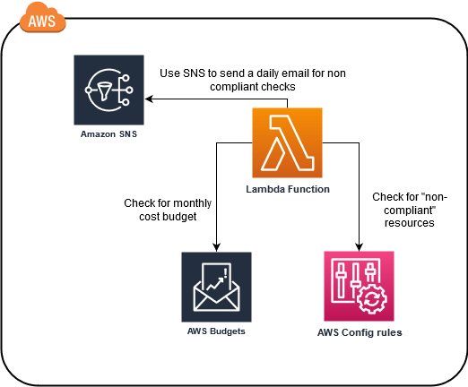

# AWS startup check

Often times AWS startup customers need guidance on basic best practices to keep their account secure and operating with 
best practices. This CDK application runs a daily check on an AWS account and report via email for identified issues.  
This can help startups to keep themselves informed on best practices and how to follow them.

## Architecture

Most of the checks for best practices are set by using 
[AWS Config rules](https://docs.aws.amazon.com/config/latest/developerguide/evaluate-config.html) and there's a Lambda 
Function running on a daily basic reporting on any "non-compliant" checks with Config rules and also few other checks, 
such is there at least one monthly cost budget set on the account.  
The application also tag all the created resources with "Environment=production" & "Project=startup-checks" tags and 
also set a general monthly cost budget (check the installation section for more details).




## Installation

The AWS startup quick start is based on [AWS CDK](https://docs.aws.amazon.com/cdk/latest/guide/home.html). 
To deploy the this solution, a CDK environment must be set first. You can 
[install AWS CDK](https://docs.aws.amazon.com/cdk/latest/guide/getting_started.html#getting_started_install), use 
[Cloud9](https://aws.amazon.com/cloud9/), or [AWS CloudShell](https://aws.amazon.com/cloudshell/)
on your local environment.


Clone this repo to you environment
```
git clone TODO: insert repo url
```

open the file `app.config.json` and edit the configuration parmaters.  
**account** - set you AWS 12 digits [account id](https://docs.aws.amazon.com/IAM/latest/UserGuide/console_account-alias.html).  
**region** - set you prefered AWS region (e.g., us-west-2, us-east-1, etc.). 
[See a full list of available regions](https://docs.aws.amazon.com/AmazonRDS/latest/UserGuide/Concepts.RegionsAndAvailabilityZones.html)  
**emailSubscriber** - set an email address to recievce the daily notifications.  
**monthlyBudget** - the overall monthly cost budget for the account. By default when a 50% of usage thershold breached 
an email will be sent to the emailSubscriber email address.  
**requiredTags** - Tags that are required on AWS resources. The check on tags are based on this configuration.
```
{
    "accountID": "111111111111",
    "region": "us-west-2",
    "emailSubscriber": "YOUR EMAIL ADDRESS",
    "monthlyBudget": 100,
    "requiredTags": ["Environment", "Project"]
}
```

Save the configuration file and install the required packages for this solution.
```
npm install
```

Deploy the solution.
```
cdk deploy
```

When prompted to created specific resources, press on "y" and enter.


## Checks

The startup quick start checks are backup by 
[AWS Config Rules](https://docs.aws.amazon.com/config/latest/developerguide/evaluate-config.html). Config Rules will 
mark resources that are not complinat and a daily Lambda function job will list all the non compliant resources and 
will send an email with a summary of these resources.

A list of the checks:  
**Multi-Factor Authentication (MFA) enabled on the root account** - Check if 
[MFA](https://docs.aws.amazon.com/IAM/latest/UserGuide/id_credentials_mfa.html) 
is enabled on the root account. If MFA is not enabled, this check will be marked as non-compliant. It is a best practice 
to set MFA (virtual or hardware) on the AWS root account (root account is reffered to when you login with email and 
password and not with [IAM users](https://docs.aws.amazon.com/IAM/latest/UserGuide/id_users.html])) to increase security 
on your AWS account.

**Access keys set on root account** - Check if there are 
[access keys](https://docs.aws.amazon.com/IAM/latest/UserGuide/id_root-user.html) 
associated with the root account. If there are access keys associated with the root account, this check will 
be marked as non-compliant. Root account credentials can not be limited and for increaed security purposes it is best 
not to use access keys on the root account.

**EBS volumes not attached** - Check if there are [EBS volumes](https://aws.amazon.com/ebs/) that are **not** attached 
to an EC2 instance. EBS volumes that are not attahced to an EC2 instance will be marked as non-compliant. For cost 
optimization purposes make sure that there are no EBS volumes that are not attached to an EC2 instance. If you need 
to keep data stored on EBS without attaching it to an EC2 for a long period of time, consider creating a 
[snapshot](https://docs.aws.amazon.com/AWSEC2/latest/UserGuide/EBSSnapshots.html) from the volume and then delete it.

**Unassociated Elastic IPs** - Check if there are Elastic IPs (EIPs) that are not associated with a network interface. 
If there are EIPs not associated with a network interface, they will be marked as non-compliant. Unassociated EIPs are 
charged while associated EIPs are not. If you don’t need an EIP address, you can stop the charges by 
[releasing the IP address](https://docs.aws.amazon.com/AWSEC2/latest/UserGuide/elastic-ip-addresses-eip.html#using-instance-addressing-eips-releasing).

**RDS public access** - Check if there are RDS instances that are configured with a public internet access. Any RDS 
instance that is configured with public access will be marked as non-compliant. It is best practice to keep the RDS 
instance access private and also use a private subnet.

**Tags on resources** - Check if there are specific tags attached to AWS resources. Resources without these tags will 
be marked as non-compliant. Tags can help you manage, identify, organize, search for, and filter resources. Learn more 
about [tags best practices](https://docs.aws.amazon.com/general/latest/gr/aws_tagging.html)

**S3 public access** - Check if S3 buckets are not allowed to be public. If a bucket policy or bucket ACL allow public 
read, then the S3 bucket will be marked as non compliant. It is best practive not to allow public access to S3 buckets. 
If you want to serve static assests from S3, put a 
[CloudFront](https://aws.amazon.com/premiumsupport/knowledge-center/cloudfront-serve-static-website/) 
distribution infront of it.

**Budget on account** - Check if there are any budgets set on the account. If there's no monthly cost budget set, this 
will return a message to create a monthly cost budget. A monthly cost budget can help track the monthly cost and alert 
if the current usage passes a certain threshold.